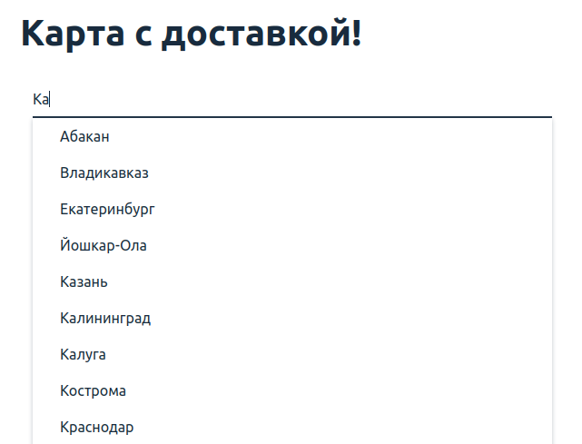
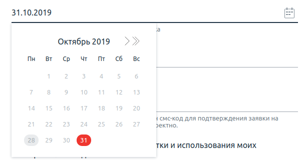

# Домашнее задание к занятию «2.2. Selenide»

## Решения
 * <a href="https://github.com/Nephedov/5.Automated-Testing/blob/e7f32db1446db21d28d75f6fc3f35559384127df/src/main/java/ru/netology/Date.java">Date.java</a>.
 * <a href="https://github.com/Nephedov/5.Automated-Testing/blob/e7f32db1446db21d28d75f6fc3f35559384127df/src/test/java/ru/netology/CardOrderDeliveryTest.java">CardOrderDeliveryTest.java</a> - класс с автотестами на основе Selenide.
## Что было сделано
  * Создан и настроен Gradle проект с зависимостями:
    * JunitJupier.
    * Selenide.
  * Подключен к проекту AppVeyor. Настроен appveyor.yml. Добавлен бейдж в README.md, о статусе сборки при пуше.
  * Реализован служебный класс получения текущей даты со сдвигом n-дней - Date.java.
  * Автоматизированно тестирование формы заказа доставки карты.
## Задача №1: заказ доставки карты

Вам необходимо автоматизировать тестирование формы заказа доставки карты:

Требования к содержимому полей:
1. Город — [один из административных центров субъектов РФ](https://ru.wikipedia.org/wiki/%D0%90%D0%B4%D0%BC%D0%B8%D0%BD%D0%B8%D1%81%D1%82%D1%80%D0%B0%D1%82%D0%B8%D0%B2%D0%BD%D1%8B%D0%B5_%D1%86%D0%B5%D0%BD%D1%82%D1%80%D1%8B_%D1%81%D1%83%D0%B1%D1%8A%D0%B5%D0%BA%D1%82%D0%BE%D0%B2_%D0%A0%D0%BE%D1%81%D1%81%D0%B8%D0%B9%D1%81%D0%BA%D0%BE%D0%B9_%D0%A4%D0%B5%D0%B4%D0%B5%D1%80%D0%B0%D1%86%D0%B8%D0%B8).
1. Дата — не ранее трёх дней с текущей даты.
1. В поле фамилии и имени разрешены только русские буквы, дефисы и пробелы.
1. В поле телефона — только 11 цифр, символ + на первом месте.
1. Флажок согласия должен быть выставлен.

Тестируемая функциональность: отправка формы.

Поля «Город» и «Дата» заполняются через прямой ввод значений без использования выбора из выпадающего списка и всплывающего календаря.

Условия: если все поля заполнены корректно, то форма переходит в состояние загрузки:

Важно: состояние загрузки не должно длиться более 15 секунд.

После успешной отправки формы появится всплывающее окно об успешном завершении бронирования:

Вам необходимо самостоятельно изучить элементы на странице, чтобы подобрать правильные селекторы. Обратите внимание, что элементы могут быть как скрыты, так и динамически добавляться или удаляться из DOM.

**Важно: Дата и время всегда будут уязвимым местом ваших тестов.**   

Ключевая ловушка в том, что, если вы их захардкодите, то тест, который работал сегодня, уже может не работать завтра, через неделю, месяц, потому что дата может перейти в разряд условного прошлого для приложения и стать невалидной.   
Кроме того, дата и время — это одно из немногих мест в тестах, где вам **иногда** придётся писать логику.   

Для решения данной задачи тоже будет необходимо выполнить генерацию даты согласно требований, описанных в условии.   

Рекомендуем для генерации строки с датой использовать класс [LocalDate](https://docs.oracle.com/en/java/javase/11/docs/api/java.base/java/time/LocalDate.html), имеющий все необходимые инструменты:   
- метод `now()` этого класса вернет вам текущую дату  
- `plusDays(long daysToAdd)` умеет добавлять к дате указанное количество дней  
- `format(DateTimeFormatter formatter)` выполнит форматирование даты из типа LocalDate в String используя переданный аргументом [DateTimeFormatter](https://docs.oracle.com/en/java/javase/11/docs/api/java.base/java/time/format/DateTimeFormatter.html)      

    
Подсказка
      

Поле ввода, которое необходимо заполнить в рамках сценария может быть заполнено значением по-умолчанию.   

Для заполнения такого поля вам придется его предварительно очистить. При этом метод `clear()` работает далеко не на всех формах.  
В таком случае вам придётся повторить действия пользователя на странице.   
    
Содержимое поля необходимо выделить и послать нажатие кнопок для удаления текста в поле.   
Нажатие клавиш умеет посылать метод `sendKeys(CharSequence... keysToSend)`, а необходимые клавиши вы найдете в енаме [Keys](https://www.selenium.dev/selenium/docs/api/java/org/openqa/selenium/Keys.html).          
Выделить текст можно двойным кликом или сочетанием клавиш.        

## Задача №2: взаимодействие с комплексными элементами (необязательная)

Большинство систем старается помогать пользователям ускорить выполнение операций: для этого предоставляются формы с автодополнением и элементы вроде календарей.

Проверьте отправку формы, используя следующие условия:
1. Ввод двух букв в поле «Город», после чего выбор нужного города из выпадающего списка:

2. Выбор даты на неделю вперёд, начиная от текущей даты, через инструмент календаря:

