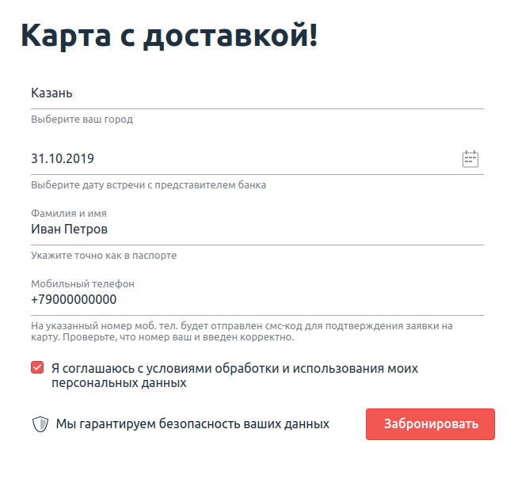
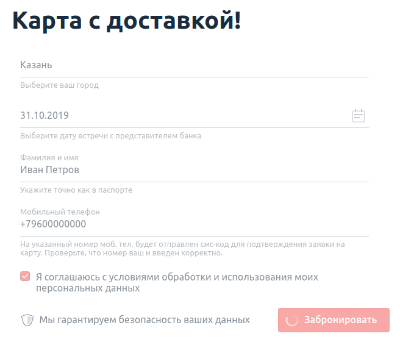
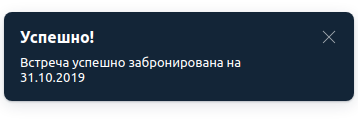

# Домашнее задание к занятию «2.2. Selenide»

## Решения
 * <a href="https://github.com/Nephedov/5.Automated-Testing/blob/main/src/main/java/ru/netology/Date.java">Date.java</a> - класс с методом генерации даты.
 * <a href="https://github.com/Nephedov/5.Automated-Testing/blob/main/src/test/java/ru/netology/CardOrderDeliveryTest.java">CardOrderDeliveryTest.java</a> - класс с автотестами на основе Selenide.
## Что было сделано
* Настроен <a href="https://github.com/Nephedov/5.Automated-Testing/blob/main/build.gradle">build.gradle</a> с зависимостями:
  * JunitJupier.
  * Selenide.
* Подключен к проекту AppVeyor. Настроен <a href="https://github.com/Nephedov/5.Automated-Testing/blob/main/.appveyor.yml">appveyor.yml</a>. Добавлен бейдж в README.md, о статусе сборки при пуше.
* Реализован служебный класс получения текущей даты со сдвигом n-дней - <a href="https://github.com/Nephedov/5.Automated-Testing/blob/main/src/main/java/ru/netology/Date.java">Date.java</a>.
* Автоматизированно тестирование формы заказа доставки карты -
  <a href="https://github.com/Nephedov/5.Automated-Testing/blob/main/src/test/java/ru/netology/CardOrderDeliveryTest.java">CardOrderDeliveryTest.java</a>.
## Описание Задания №1: заказ доставки карты

Вам необходимо автоматизировать тестирование формы заказа доставки карты:

Требования к содержимому полей:
1. Город — [один из административных центров субъектов РФ](https://ru.wikipedia.org/wiki/%D0%90%D0%B4%D0%BC%D0%B8%D0%BD%D0%B8%D1%81%D1%82%D1%80%D0%B0%D1%82%D0%B8%D0%B2%D0%BD%D1%8B%D0%B5_%D1%86%D0%B5%D0%BD%D1%82%D1%80%D1%8B_%D1%81%D1%83%D0%B1%D1%8A%D0%B5%D0%BA%D1%82%D0%BE%D0%B2_%D0%A0%D0%BE%D1%81%D1%81%D0%B8%D0%B9%D1%81%D0%BA%D0%BE%D0%B9_%D0%A4%D0%B5%D0%B4%D0%B5%D1%80%D0%B0%D1%86%D0%B8%D0%B8).
1. Дата — не ранее трёх дней с текущей даты.
1. В поле фамилии и имени разрешены только русские буквы, дефисы и пробелы.
1. В поле телефона — только 11 цифр, символ + на первом месте.
1. Флажок согласия должен быть выставлен.

Тестируемая функциональность: отправка формы.

Поля «Город» и «Дата» заполняются через прямой ввод значений без использования выбора из выпадающего списка и всплывающего календаря.

Условия: если все поля заполнены корректно, то форма переходит в состояние загрузки:

Важно: состояние загрузки не должно длиться более 15 секунд.

После успешной отправки формы появится всплывающее окно об успешном завершении бронирования:

Для решения данной задачи тоже будет необходимо выполнить генерацию даты согласно требований, описанных в условии.       

## Задача №2: взаимодействие с комплексными элементами (необязательная)

Проверьте отправку формы, используя следующие условия:
1. Ввод двух букв в поле «Город», после чего выбор нужного города из выпадающего списка.
2. Выбор даты на неделю вперёд, начиная от текущей даты, через инструмент календаря.
